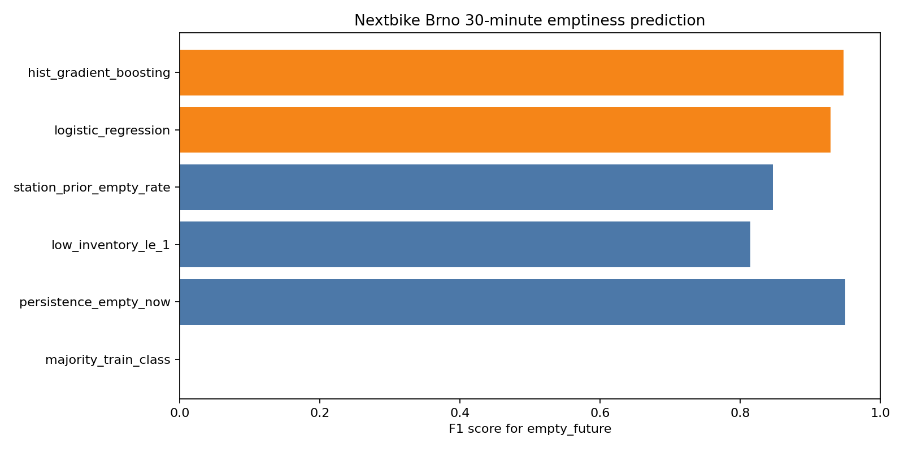

# Nextbike Brno Availability Modeling Report

Generated at: `2026-05-25T09:43:47+02:00`

## Executive Summary

We now have an end-to-end local pipeline: poll GBFS, normalize to DuckDB, build a station-level ML dataset, evaluate simple baselines, and train first sklearn tabular models.

The current data now includes evening, overnight, and early morning behavior. The strongest baseline is still simple persistence: assume a station's 30-minute future emptiness equals its current emptiness. That baseline is hard to beat because many stations remain stable over a 30-minute horizon.

Best baseline by F1: `persistence_empty_now` with F1 `0.9497`.

Best trained model by F1: `hist_gradient_boosting` with F1 `0.9477`.

Interpretation: The best trained model does not beat persistence on this split. That makes persistence the operational baseline to beat. We still need daytime, afternoon, and weekend data before judging model class quality.

## Data Snapshot

| Metric | Value |
|---|---|
| `collection_runs` | `793` |
| `first_collected_at` | `2026-05-24 18:32:12+02:00` |
| `latest_collected_at` | `2026-05-25 09:43:30+02:00` |
| `station_rows` | `235521` |
| `free_bike_rows` | `434129` |
| `distinct_stations` | `297` |
| `bikes_available_min_avg_max` | `542/564.49/573` |
| `db_size_mb` | `24.76` |

## Dataset

Target: `empty_future`, meaning whether a station is empty at the first snapshot between 30 and 40 minutes after `collected_at`.

Build settings:

- horizon minutes: `30`
- max target delay minutes: `40`
- lag tolerance minutes: `10`

| Metric | Value |
|---|---|
| `rows` | `224829` |
| `stations` | `297` |
| `first_collected_at` | `2026-05-24 20:17:28+02:00` |
| `latest_collected_at` | `2026-05-25 09:12:36+02:00` |
| `empty_future_rate` | `0.3974` |
| `avg_abs_change` | `0.088` |
| `changed_rate` | `0.0699` |
| `null_lag_5m` | `2970` |
| `null_lag_15m` | `6831` |

Feature engineering started in `build-dataset`:

- current station state: `bikes_now`, `docks_now`, `empty_now`
- lag features: `bikes_lag_5m`, `bikes_lag_15m`
- deltas: `bikes_delta_5m`, `bikes_delta_15m`
- cyclic time features: `hour_sin`, `hour_cos`, `weekday_sin`, `weekday_cos`
- short rolling station history: `bikes_avg_30m`, `empty_rate_30m`, `samples_30m`
- station metadata: `station_id`, `region_id`, `lat`, `lon`, `capacity`

## Baseline Evaluation

Temporal split:

- train rows: `168399`
- test rows: `56430`
- train window: `2026-05-24 20:17:28+02:00 -> 2026-05-25 05:56:39+02:00`
- test window: `2026-05-25 05:57:41+02:00 -> 2026-05-25 09:12:36+02:00`

| Model | Accuracy | Precision | Recall | F1 | ROC AUC | Avg precision | Pred empty rate |
|---|---:|---:|---:|---:|---:|---:|---:|
| `persistence_empty_now` | 0.9584 | 0.9603 | 0.9394 | 0.9497 | 0.9558 | 0.9274 | 0.4086 |
| `station_prior_empty_rate` | 0.8773 | 0.8843 | 0.8125 | 0.8469 | 0.9194 | 0.8906 | 0.3838 |
| `low_inventory_le_1` | 0.8110 | 0.6912 | 0.9898 | 0.8140 | 0.9715 | 0.9412 | 0.5982 |
| `majority_train_class` | 0.5823 | 0.0000 | 0.0000 | 0.0000 | 0.5000 | 0.4177 | 0.0000 |

## First Models

Models trained:

- `logistic_regression`: one-hot station/region, scaled numeric features, balanced classes.
- `hist_gradient_boosting`: one-hot station/region, numeric features, nonlinear tree boosting.

| Model | Accuracy | Precision | Recall | F1 | ROC AUC | Avg precision | Pred empty rate |
|---|---:|---:|---:|---:|---:|---:|---:|
| `hist_gradient_boosting` | 0.9566 | 0.9557 | 0.9398 | 0.9477 | 0.9804 | 0.9681 | 0.4108 |
| `logistic_regression` | 0.9406 | 0.9273 | 0.9308 | 0.9291 | 0.9782 | 0.9644 | 0.4193 |

## Findings

- The problem is currently dominated by inertia. `empty_now` is still a very strong predictor of `empty_future`.
- `station_prior_empty_rate` is strong, which means station identity matters.
- `low_inventory_le_1` has perfect or near-perfect recall but many false positives; useful if the product goal is "never walk to a station likely to be empty".
- The trained models are useful as scoring/ranking models because ROC AUC and average precision are high; current F1 versus persistence should not be overinterpreted until we have broader daytime coverage.

## Next Work

1. Keep collecting for several full days.
2. Re-run this report after a morning commute and after one full weekday.
3. Add threshold tuning for product goals: nearest reliable bike cares more about recall than raw accuracy.
4. Add weather and event/calendar features later.
5. Add route-level evaluation: "would this command recommend a station that still has a bike when I arrive?"
